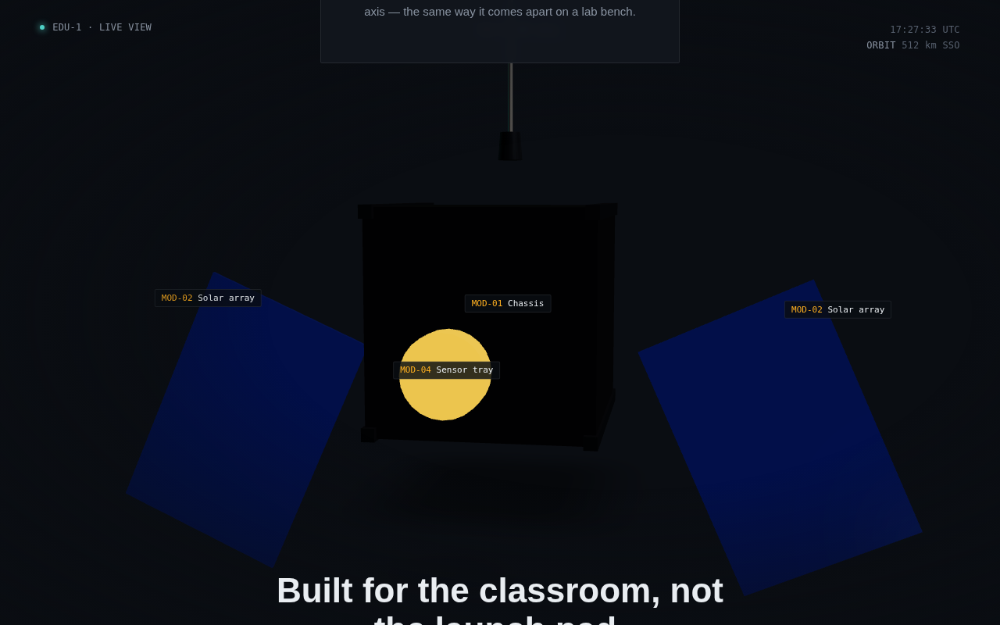

# EDU-1 — Modular Orbital Platform

**A scroll-driven 3D product showcase for a fictional educational CubeSat kit** — solar panels hinge open, an antenna extends, a sensor tray lights up, and the whole model turns as you scroll, ending in a drag-to-rotate exploded view with labelled parts.

**[Live demo →](https://3d-satellite-project.vercel.app/)**



Built to demonstrate the "interactive 3D + motion narrative" pattern used on hardware and deep-tech product sites — the pairing of **Three.js** (via React Three Fiber) for the 3D object and **GSAP ScrollTrigger** for tying its motion to scroll position.

## What it does

| Scroll section | What happens to the model |
|---|---|
| Hero | Model turns slowly, idle |
| Chassis | Camera dollies in |
| Power | Solar panels hinge open on their pivots, panel material brightens |
| Comms | Antenna extends and telescopes upward |
| Payload | Sensor tray lights up (emissive) and edges forward |
| Exploded view | All parts separate along their own axis, labels fade in, drag-to-rotate re-enables |

The whole model also does one continuous slow rotation tied to total scroll progress, so the sections read as one connected motion rather than disjointed steps.

## Stack

- **React 19 + Vite** — app shell and build
- **React Three Fiber + drei** — Three.js/WebGL in a component model
- **GSAP + ScrollTrigger** — scroll-scrubbed animation

The satellite is built entirely from primitives (boxes, cylinders) directly in Three.js — there's no `.glb`/`.gltf` file to fetch, so the scene has zero external asset dependencies beyond web fonts.

## Notable implementation details

- All scroll-driven motion writes directly to Three.js object properties via refs, never through React state — going through `setState` on every scroll tick visibly lags.
- The model's refs are only wired to GSAP once the model signals it has actually mounted inside the Canvas (`onReady` callback), rather than assuming React's normal effect order — a `<Canvas>` from React Three Fiber mounts its scene graph through its own renderer, which isn't guaranteed to have committed by the time a sibling effect runs.
- No HDR environment map — reflections come from a small manual light rig instead, so there's no runtime fetch to an external CDN that could fail and take the whole scene down with it.
- `prefers-reduced-motion` is respected: animations snap instead of scrub for users with that OS setting on.
- A WebGL-support check swaps in a static fallback background on devices/browsers that can't run the scene.
- The HUD clock is isolated into its own component specifically so its per-second re-render never touches the Canvas tree above it.

## Run it locally

Requires Node 18+.

```bash
git clone <this-repo-url>
cd satellite-showcase
npm install
npm run dev
```

Open the local URL it prints (typically `http://localhost:5173`).

## Build & deploy

```bash
npm run build     # → dist/
npm run preview   # sanity-check the production build locally
```

Deployed here on Vercel — `vercel` with defaults works out of the box (Vite is auto-detected). Any static host works equally well since there's no server-side code.

## What this project deliberately doesn't cover

Being upfront about scope, since it's easy to overclaim on a portfolio piece:

- No real `.gltf`/Draco/LOD model pipeline — the model here is primitives, not an optimised imported asset.
- No Framer, Webflow, Spline, or Rive — this project is specifically the Three.js + GSAP pairing.
- No CMS wiring — all copy lives in `src/content.js`.
- No formal performance audit (Lighthouse, etc.) has been run against it.

## Project structure

```
src/
  App.jsx                    → page layout, section refs, wiring
  content.js                 → all copy/specs
  styles.css                 → design tokens + layout
  components/
    Scene.jsx                → R3F Canvas, lighting, camera, part labels
    SatelliteModel.jsx       → procedural 3D model + exposed refs
    HudClock.jsx             → isolated live-clock HUD readout
  hooks/
    useScrollTimeline.js     → all GSAP ScrollTrigger wiring
```
